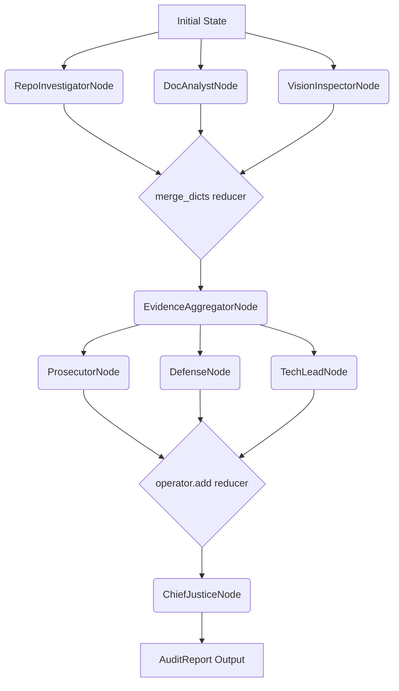

# Automaton Auditor - FDE Week 2

A LangGraph-based multi-agent system for autonomous code audit and governance.

## Features

- **Parallel Detective Agents**: RepoInvestigator, DocAnalyst, VisionInspector running simultaneously
- **Evidence Collection**: Structured evidence with confidence scores
- **Sandboxed Execution**: Safe git cloning in temporary directories
- **AST Parsing**: Code analysis without regex
- **PDF Analysis**: Text extraction and keyword detection
- **Diagram Detection**: Vision analysis for PDF diagrams

## Setup

```bash
# Install uv (if not installed)
curl -LsSf https://astral.sh/uv/install.sh | sh

# Clone and setup
git clone https://github.com/yourusername/automaton-auditor
cd automaton-auditor
uv venv
source .venv/bin/activate  # On Windows: .venv\Scripts\activate
# Install dependencies exactly as pinned in the reproducible lockfile (uv.lock)
uv sync
```

### Environment Variables

Copy the environment template:
```bash
cp .env.example .env
```

Populate the `.env` file with the following keys:
- `OPENAI_API_KEY`: Required for default judge and detective LLMs (GPT-4o/mini).
- `ANTHROPIC_API_KEY`: Optional, if replacing default LLMs with Claude models.
- `LANGCHAIN_API_KEY`: LangSmith API key for tracing and debugging runs.
- `LANGCHAIN_TRACING_V2="true"`: Enables tracing to LangSmith.
- `LANGCHAIN_PROJECT`: Your project name for telemetry formatting.

*(Note: While `pyproject.toml` manages loose dependencies, `uv.lock` ensures exact, reproducible dependency resolution. If you aren't using `uv`, you can generate a strict `requirements.txt` via `uv pip compile pyproject.toml -o requirements.txt`.)*

## Usage

```bash
python -m src.main --repo <GITHUB_URL> --pdf <PDF_PATH> [--full-history]
```

**Flags:**
- `--repo`: Target GitHub repository URL
- `--pdf`: Path to the PDF audit report to analyze
- `--full-history`: (Optional) Perform deep forensic git clone with commit history (slower but enables contributor frequency analysis)

Example:
```bash
python -m src.main --repo https://github.com/langchain-ai/langgraph --pdf test_report.pdf --full-history
```

## Project Structure

```
src/
├── __init__.py
├── main.py              # Entry point
├── state.py             # Pydantic models + reducers
├── graph.py             # LangGraph parallel execution
├── nodes/
│   └── detectives.py    # Repo, Doc, Vision nodes
└── tools/
    ├── repo_tools.py    # Git cloning, AST parsing
    ├── doc_tools.py     # PDF extraction
    └── vision_tools.py  # Diagram detection
```

## Architecture Diagram



## Results (Interim)

- ✅ **Evidence Collection**: Strict Pydantic models with attribution
- ✅ **90.9% success rate**
- ✅ **All detectives working in parallel**
- ✅ **Neutral handling of missing diagrams**
- ✅ **Transparent shallow clone explanation**

## Requirements

- Python 3.10+
- Dependencies managed via `pyproject.toml`